# WB Product Analytics

Сервис мониторинга товаров Wildberries: собирает товары по запросу (по требованию
и по расписанию), хранит историю их цен и даёт разобрать выборку через таблицу с
фильтрами и сортировкой, графики, агрегаты, сравнение запросов, алерты по цене и
экспорт в CSV/XLSX.

Построен на **гексагональной архитектуре (Ports & Adapters)** как **модульный
монолит из ограниченных контекстов**, рассчитанный на разделение в микросервисы.

- **Бэкенд:** Python 3.12 · Django 5 + DRF · Celery + Redis · PostgreSQL 16
- **Фронтенд:** React 18 + TypeScript + Vite · TanStack Table · Recharts

## Возможности

Сервис устроен как SPA с двумя рабочими зонами: тёмный сайдбар с разделами и
светлая рабочая область. Публичная главная страница открыта всем, само рабочее
пространство (`/app`) доступно после входа.

### Главная страница

Лендинг с описанием проекта, кратким перечнем возможностей и точками входа:
регистрация, вход по логину и вход через Google в один клик.

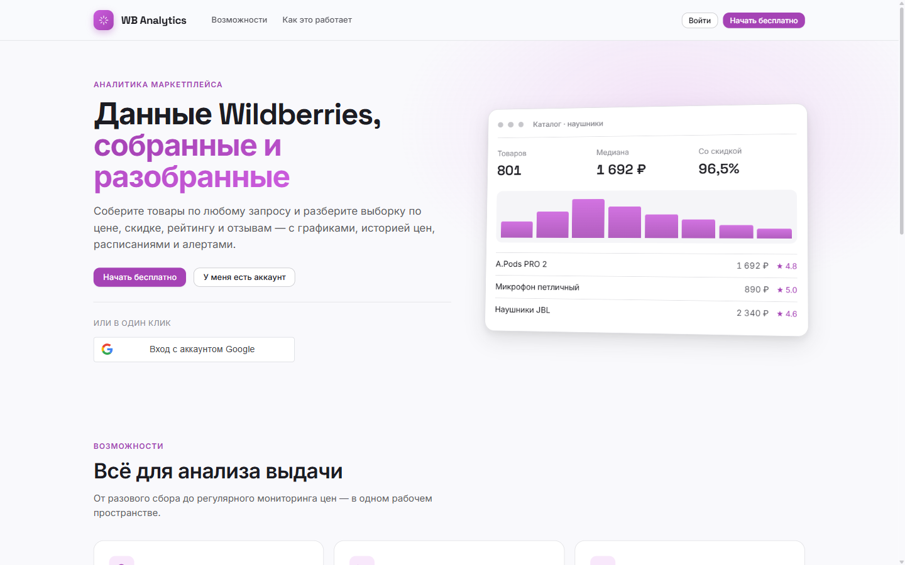

Блок возможностей и сценарий «три шага до первой выборки»:

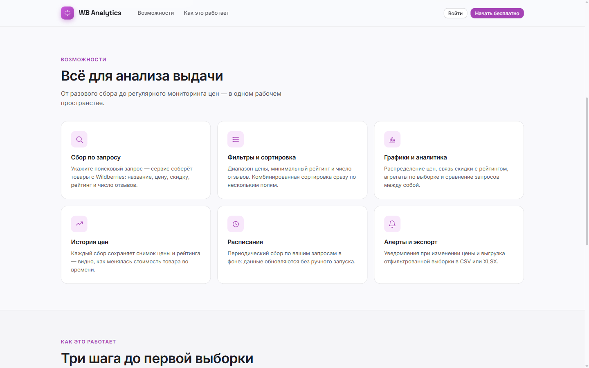

### Регистрация и вход

Вход по логину и паролю либо через **Google** (Google Identity Services —
ID-токен проверяется на бэкенде, аккаунт создаётся автоматически при первом входе).
Гость, попавший на любой закрытый адрес, отправляется сюда и после входа
возвращается ровно туда, куда шёл.

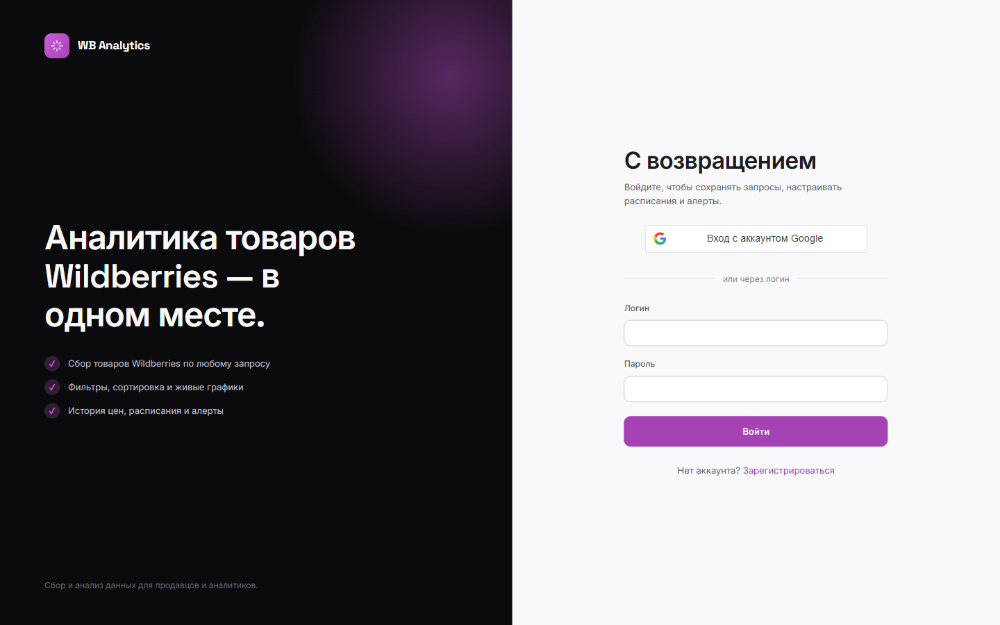

### Обзор

Ключевые метрики по текущей выборке — количество товаров, средняя цена, медиана,
средняя скидка и доля товаров со скидкой, — а также топ по отзывам и оба графика.

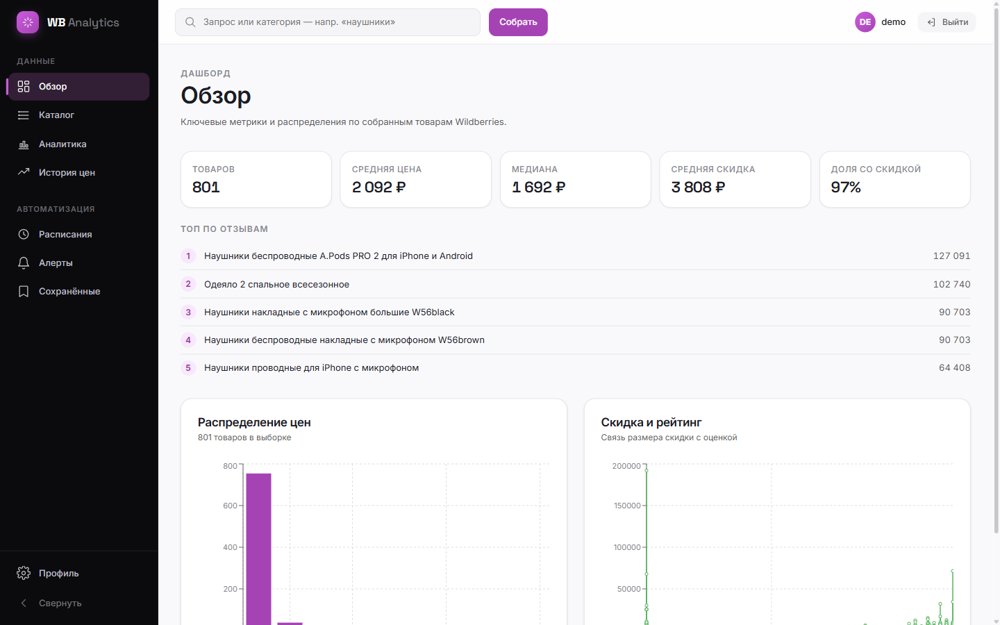

### Каталог товаров

Основной рабочий раздел: сбор по запросу, фильтрация и сортировка. Слева — панель
фильтров с диапазоном цены (по цене со скидкой), рейтингом и числом отзывов.
Название каждого товара — **ссылка на его страницу на Wildberries**. Клик по
строке открывает историю цены. Справа сверху — экспорт выборки в CSV и XLSX.

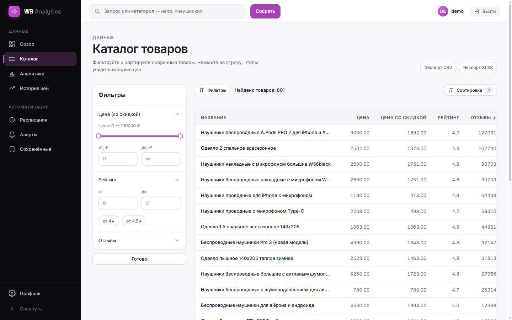

**Комбинированная сортировка.** Панель сортировки собирает произвольное число
уровней «поле + направление»: например, рейтинг по убыванию, а внутри одинаковых
рейтингов — по числу отзывов. Приоритет уровней виден в заголовках таблицы
значками `↓1`, `↓2`; есть готовые пресеты.

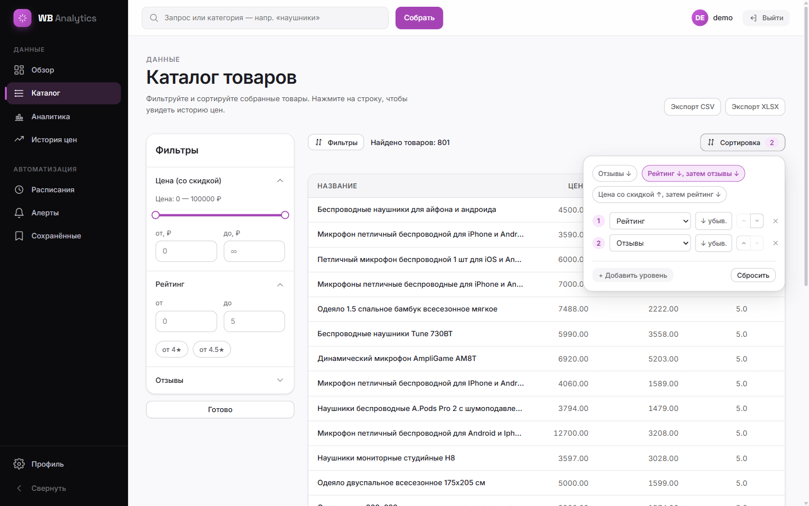

**Пагинация.** Размер страницы настраивается (10 / 25 / 50 / 100), выбор
запоминается между сессиями; показывается диапазон и номер страницы.

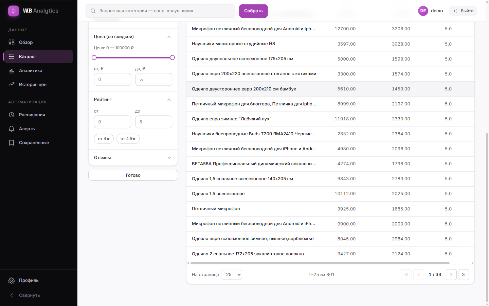

### Аналитика

Распределение цен по корзинам и зависимость размера скидки от рейтинга.

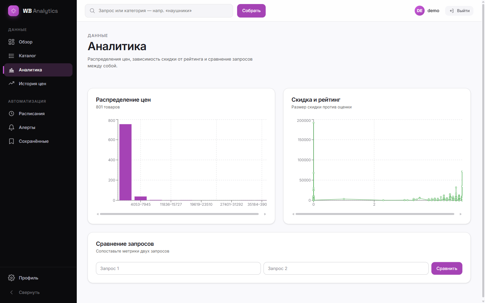

**Сравнение запросов** — метрики двух запросов бок о бок в одной таблице.

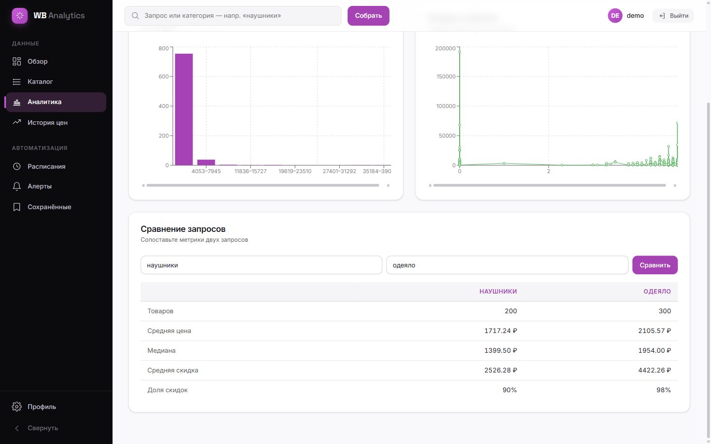

### История цен

Каждый сбор сохраняет снимок цены и рейтинга, поэтому по любому товару видно,
как менялась стоимость. График наполняется по мере накопления сборов.

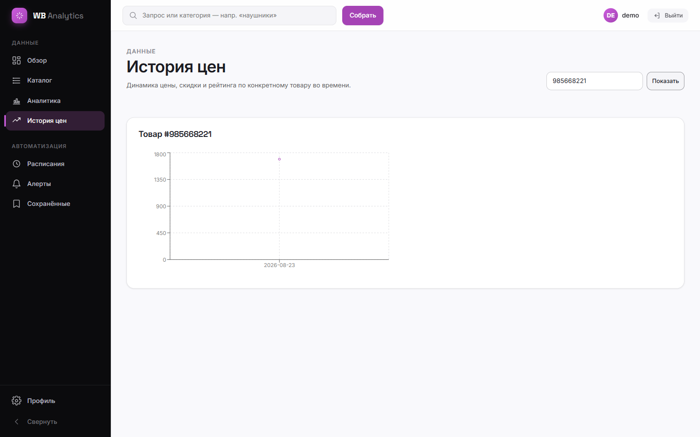

### Расписания

Периодический сбор по запросу: интервал выбирается из пресетов, расписание можно
включить, выключить или удалить. Запуск выполняет Celery Beat, сбор идёт в фоне
через worker.

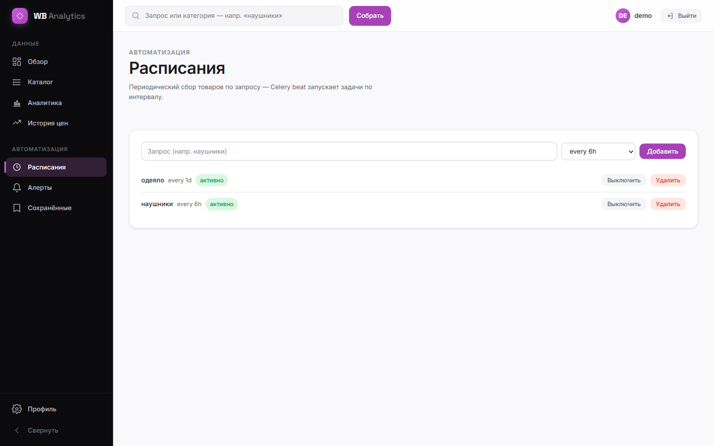

### Алерты

Правила уведомлений по цене: «цена ниже N» или «падение на N %», канал — email
или Telegram. Алерты срабатывают на событие изменения цены, с защитой от
повторных срабатываний.

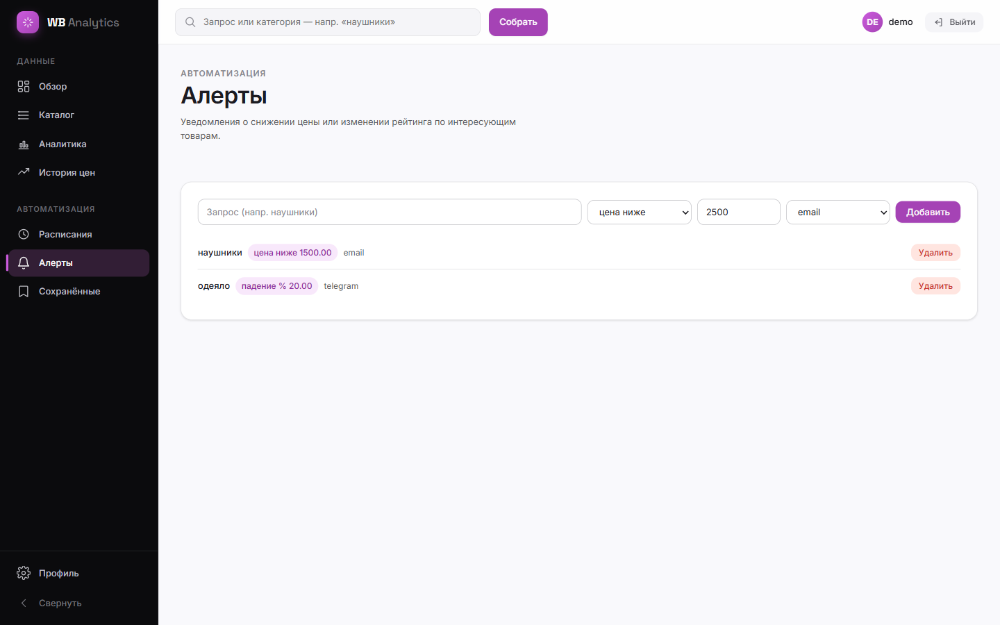

### Сохранённые запросы

Наборы фильтров сохраняются под именем и применяются одним нажатием. Записи
привязаны к владельцу — чужие не видны.

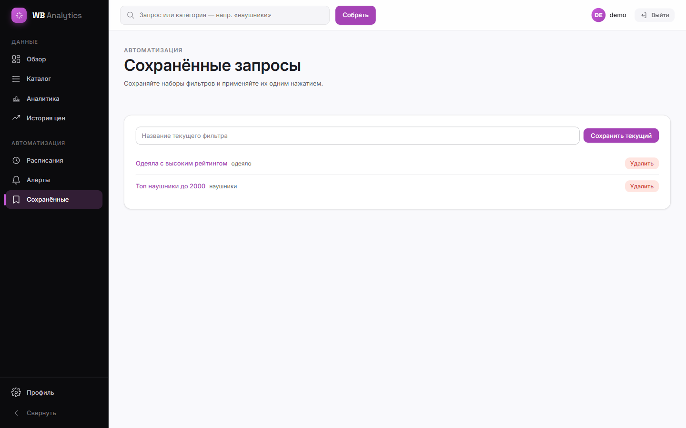

### Профиль

Данные учётной записи и подключённые способы входа.

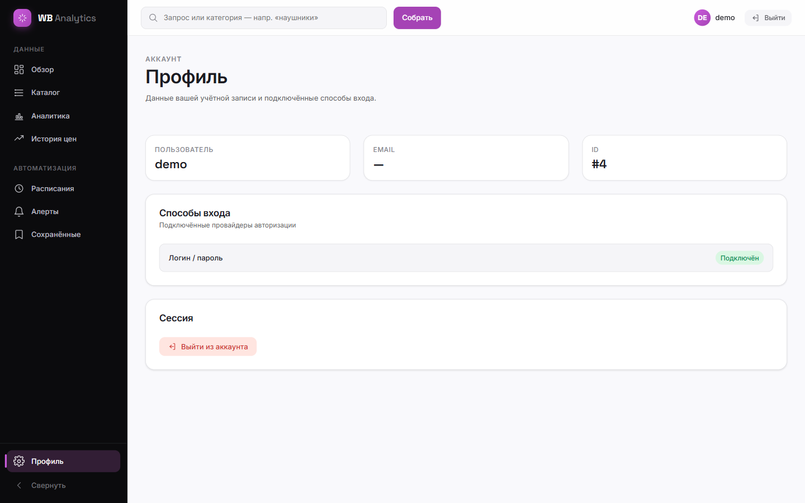

## Архитектура

Бизнес-логика живёт во фреймворко-независимых пакетах `domain/` и `application/`;
Django, DRF, httpx, Celery и openpyxl заперты в `adapters/`. Контексты общаются
только через **шину событий** (`ProductsCollected`, `PriceChanged`) — никаких
прямых вызовов. Это тот шов, по которому каждый контекст можно вынести в сервис.

```
backend/src/
├── shared/           ядро: value objects, события, порты, шина, часы, очередь задач
├── catalog/          сбор и чтение товаров (шлюз WB, парсинг, список, async-сбор)
├── analytics/        история цен, статистика, сравнение, экспорт (слушает события)
├── scheduling/       периодический сбор (Celery Beat → постановка задач в catalog)
├── notifications/    алерты по цене (слушает события → email/Telegram)
└── accounts/         авторизация (JWT) и сохранённые запросы; владение расписаниями и алертами
```

Каждый контекст устроен одинаково: `domain/` (чистый) → `application/`
(сценарии + порты) → `adapters/{inbound,outbound}` → `composition/` (единственный
корень сборки зависимостей).

**Поток событий (внутрипроцессный шов):** `catalog` публикует `ProductsCollected`
→ `analytics` сохраняет снимок цены и порождает `PriceChanged` → `notifications`
проверяет правила алертов. Переключение `EVENT_PUBLISHER=inprocess` → `bus`
уводит обмен в брокер сообщений: правка затрагивает только
`shared/composition.py` и адаптер шины, домен и сценарии не меняются.

## Быстрый старт

Требуется: Python 3.12, Node 20, Docker (для PostgreSQL и Redis).

### Бэкенд

```bash
cd backend
cp .env.example .env                 # поправьте под себя; .env не коммитится
docker compose up -d                 # PostgreSQL 16 + Redis
python -m venv .venv && . .venv/Scripts/activate   # *nix: bin/activate
pip install -e ".[dev]"
python manage.py migrate
python manage.py runserver           # http://localhost:8000
```

Фоновые обработчики (async-сбор, расписания, алерты):

```bash
celery -A config worker -l info      # задачи сбора и алертов
celery -A config beat   -l info      # тики расписаний (раз в 60 с)
```

Собрать данные — через CLI (синхронно) или через API (асинхронно):

```bash
python manage.py parse_wb "наушники"
curl -X POST http://localhost:8000/api/parse/ -H "Content-Type: application/json" -d "{\"query\":\"наушники\"}"
```

### Фронтенд

```bash
cd frontend
npm install
npm run dev                          # http://localhost:5173
```

`/` — публичная главная страница с регистрацией и входом (пароль или Google);
рабочее пространство находится по адресу `/app` и требует аккаунта.

### Вход через Google

Создайте OAuth 2.0 Client ID (тип Web) в Google Cloud Console, добавьте
`http://localhost:5173` в разрешённые JavaScript-источники и пропишите ключ:

```bash
# frontend/.env
VITE_GOOGLE_CLIENT_ID=<ваш-client-id>.apps.googleusercontent.com
# backend/.env
GOOGLE_CLIENT_ID=<ваш-client-id>.apps.googleusercontent.com
```

Client secret не нужен: бэкенд проверяет ID-токен, выданный Google Identity
Services. Без ключа вход по логину и паролю работает как обычно.

## API

| Метод и путь | Назначение |
|---|---|
| `GET /api/products/` | Фильтры (цена/рейтинг/отзывы) + сортировка + пагинация |
| `POST /api/parse/` | Поставить async-сбор в очередь → `202 {task_id}` |
| `GET /api/tasks/{id}/` | Статус асинхронной задачи |
| `GET /api/products/{wb_id}/history/` | Временной ряд цены |
| `GET /api/stats/` | Агрегаты (среднее/медиана/доля скидок/топ); повторный `query=` сравнивает запросы |
| `GET /api/export/?format=csv\|xlsx` | Выгрузка отфильтрованной выборки |
| `GET/POST/PATCH/DELETE /api/schedules/` | Расписания сбора (авторизация, только свои) |
| `GET/POST/DELETE /api/alerts/` | Алерты по цене (авторизация, только свои) |
| `POST /api/auth/…`, `GET/POST/DELETE /api/saved-searches/` | Авторизация и сохранённые запросы |
| `GET /api/health/` | Состояние БД и Redis (200 / 503) |

Чтение каталога публично; пользовательские ресурсы требуют авторизации.

## Эксплуатация базы данных

### Роль приложения

Приложение подключается ролью **`wb_app`** без суперправ, а не суперпользователем.
Роль создаётся скриптом [`backend/db/init/01-app-role.sql`](backend/db/init/01-app-role.sql):
он идемпотентен и монтируется в `/docker-entrypoint-initdb.d/`, поэтому на чистом
томе выполняется автоматически.

> **На уже существующем томе init-скрипты не запускаются.** Примените скрипт вручную:
> ```bash
> docker exec -i backend-db-1 psql -U postgres -d wb_analytics -v ON_ERROR_STOP=1 < db/init/01-app-role.sql
> ```

Роль владеет схемой `public` (миграциям нужен DDL) и имеет `CREATEDB`, потому что
pytest-django создаёт и удаляет тестовую базу на каждом прогоне. Прав `SUPERUSER`,
`CREATEROLE`, `BYPASSRLS` и `REPLICATION` у неё нет, а `PUBLIC` лишён прав на схему.

Пароль `wbapp` в примере — локальная заглушка. **В продакшене создайте роль
со своим секретом** и пропишите его в `DATABASE_URL`.

### Соединения и шифрование

| Переменная | Назначение |
|---|---|
| `DB_CONN_MAX_AGE` | Время жизни соединения, секунды. По умолчанию 60 — соединения переиспользуются между запросами вместо переподключения на каждый. |
| `DB_SSLMODE` | `disable` для локального контейнера, **`verify-full` для продакшена** — проверяются и сертификат сервера, и имя хоста. |

`CONN_HEALTH_CHECKS` включён всегда: без него Django может отдать соединение,
которое сервер уже закрыл.

Порты PostgreSQL и Redis в `docker-compose.yml` привязаны к `127.0.0.1` — снаружи
машины они недоступны. Redis требует пароль (`REDIS_PASSWORD`).

### Кэш статистики

Агрегаты `/api/stats/` кэшируются в Redis: `STATS_CACHE_TTL` задаёт время жизни в
секундах, `0` отключает кэш полностью. Помимо TTL кэш сбрасывается **после каждого
сбора** — по событию `ProductsCollected`, поэтому статистика не отдаёт данные,
устаревшие после парсинга.

### Рекомендации для продакшена

Сделано не всё, что стоит сделать при выходе в прод:

- **Разделить роли.** Сейчас `wb_app` и мигрирует, и обслуживает запросы. Надёжнее
  развести: `wb_migrate` с правом DDL для деплоя и `wb_app` только с
  `SELECT/INSERT/UPDATE/DELETE` для рантайма.
- **Row-Level Security.** Изоляция владельцев уже реализована в репозиториях
  (`filter(owner_id=...)`), а не только во вьюхах, и покрыта тестами. RLS на
  `accounts_saved_search`, `notifications_alert_rule` и `scheduling_schedule` добавил
  бы второй рубеж на случай ошибки в запросе.
- **Пулер соединений.** При росте числа воркеров gunicorn/uvicorn имеет смысл
  поставить PgBouncer: `CONN_MAX_AGE` держит по соединению на процесс.
- **Keyset-пагинация.** `page`/`page_size` работают через `OFFSET`. На текущем
  объёме это незаметно, но на сотнях тысяч строк глубокие страницы деградируют —
  тогда стоит перейти на курсор по `(reviews_count, wb_id)`.

## Тестирование

Тесты разложены по границам гексагона (domain / application / adapters / e2e).

```bash
cd backend
.venv/Scripts/python -m pytest -m "not django_db"   # офлайн: домен, сценарии, адаптеры
.venv/Scripts/python -m pytest -m "django_db"       # интеграционные и e2e (нужен PostgreSQL)
.venv/Scripts/python -m coverage run -m pytest && .venv/Scripts/python -m coverage report
cd ../frontend && npm test                          # Vitest + RTL
```

- **Офлайн (без инфраструктуры): 149 тестов** — шлюз WB работает против записанной
  фикстуры (respx), Celery выполняет задачи синхронно, нотификаторы и очереди
  подменены заглушками.
- **35 тестов с `@django_db`** (репозиторий, e2e-эндпоинты) требуют живого PostgreSQL:
  запускайте после `docker compose up -d db && python manage.py migrate`.
- Итого **184 теста бэкенда, покрытие 94%** (порог в конфиге — 80%) и
  **37 тестов фронтенда** (Vitest + Testing Library).

## Статус

Реализованы все двенадцать функциональных блоков (основное задание и расширения):
сбор данных, таблица с фильтрами и сортировкой, графики, сбор по расписанию,
асинхронный сбор, устойчивость парсера, история цен, расширенная аналитика,
сравнение запросов, алерты по цене, экспорт, а также авторизация с сохранёнными
запросами.
