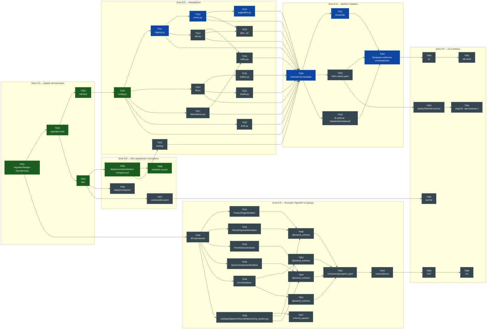
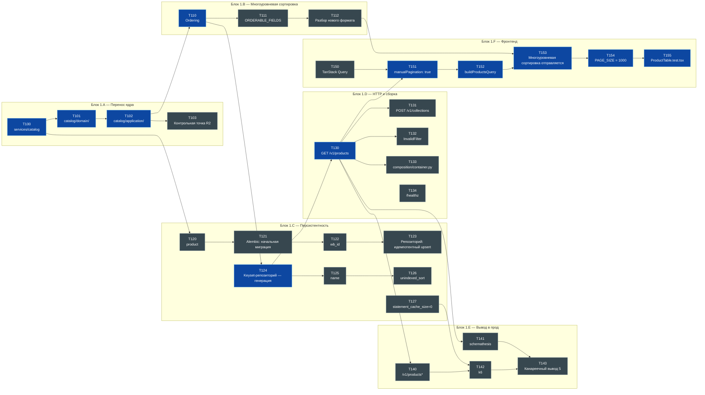

# 9. Граф задач

> **Файл генерируется.** Не редактируйте его руками — правьте
> [док. 8](08-tasks.md) и выполните `uv run python tools/task-graph.py`.
> Единственный источник статусов — таблицы задач в док. 8.

Готово **7 из 77** задач фаз 0-1.

## Как читать

| Цвет | Значение |
|---|---|
| зелёный | готово |
| оранжевый | в работе |
| синий | не начата, **лежит на критическом пути** |
| серый | не начата, путь не блокирует |

Стрелка `A --> B` читается «B зависит от A».

## Критический путь

Самая длинная цепочка зависимостей — её нельзя сократить
распараллеливанием, только выполнением:

```
  T001 → T002 → T003 → T010 → T011 → T012
  T015 → T030 → T031 → T034 → T100 → T101
  T102 → T110 → T124 → T130 → T151 → T152
  T153 → T154 → T155
```

Длина цепочки: **21**.

---

## Фаза 0 · Фундамент

Готово 7 из 47.



---

## Фаза 1 · catalog-service на FastAPI

Готово 0 из 30.



