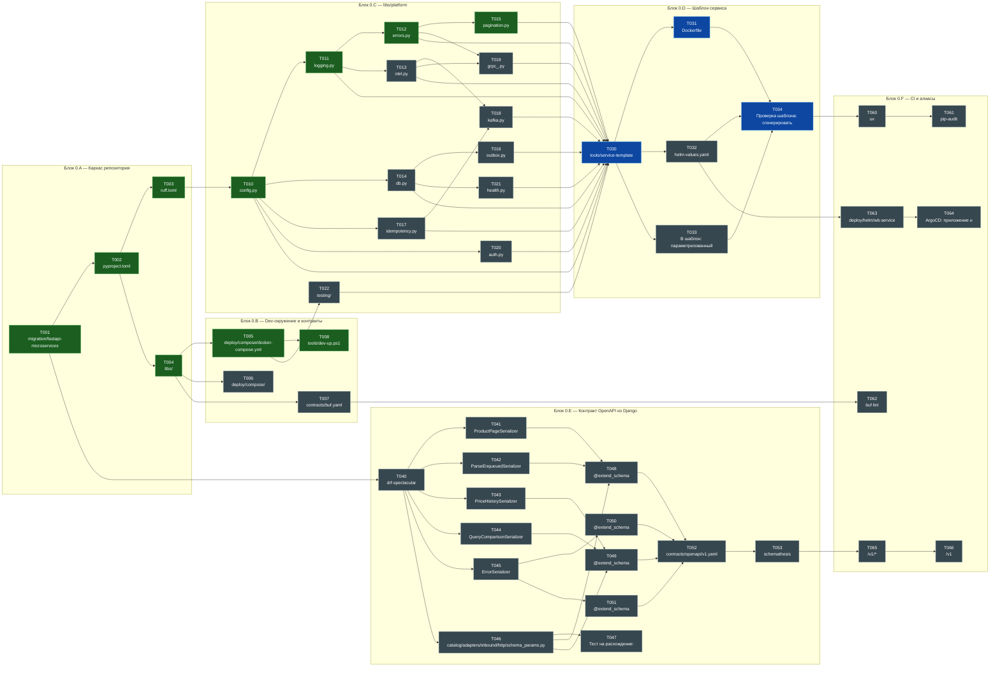
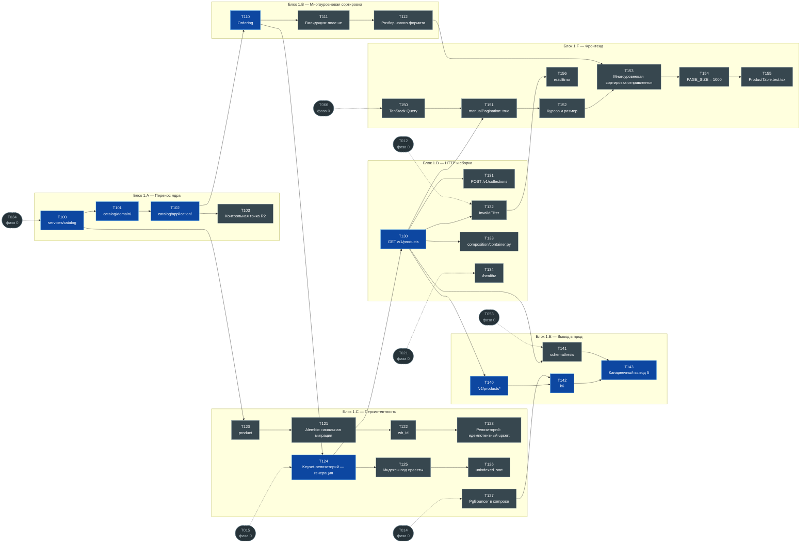
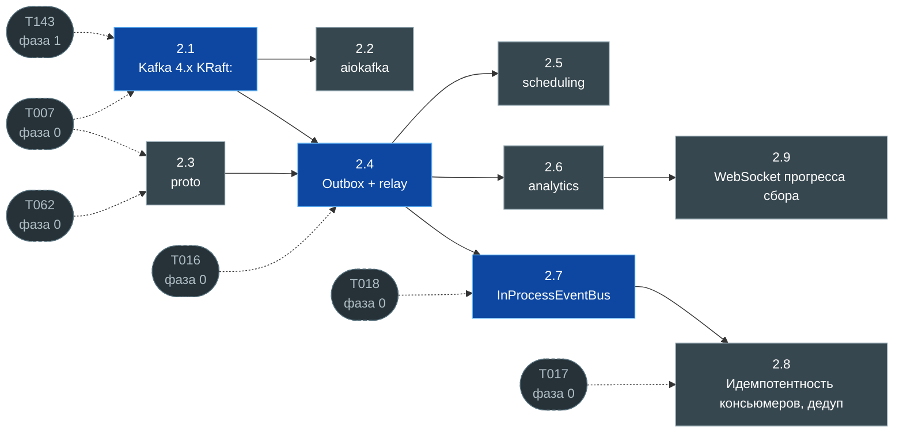
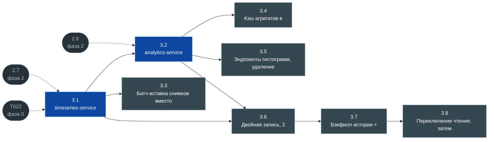
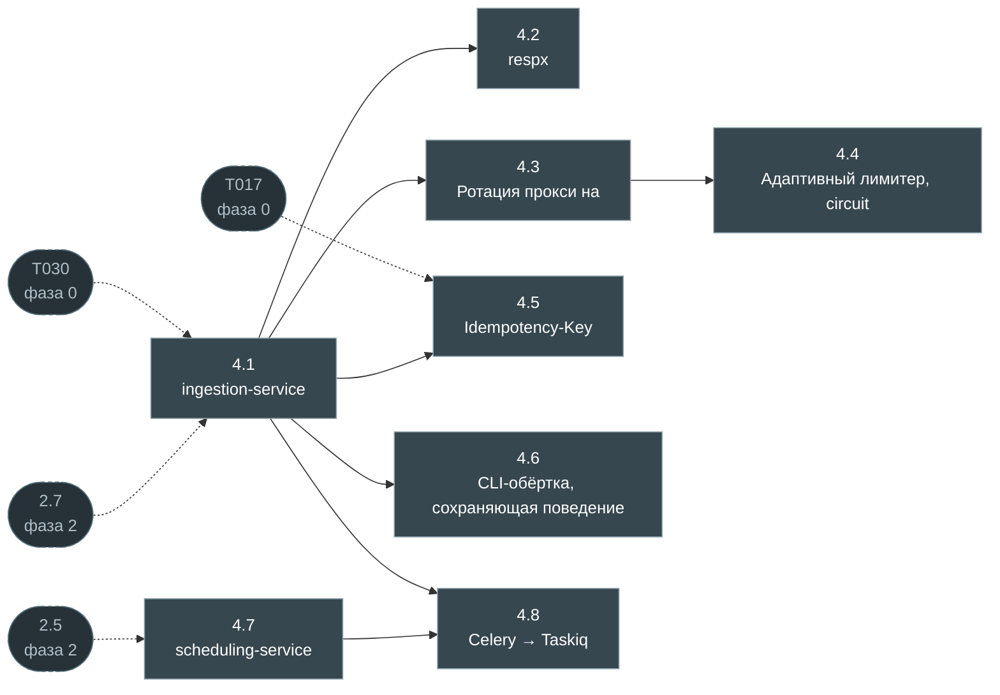
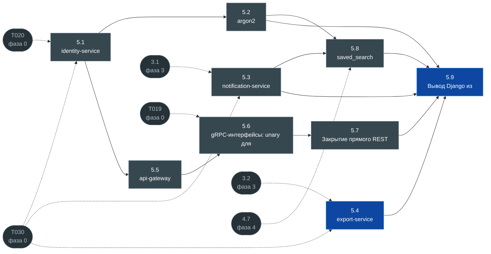
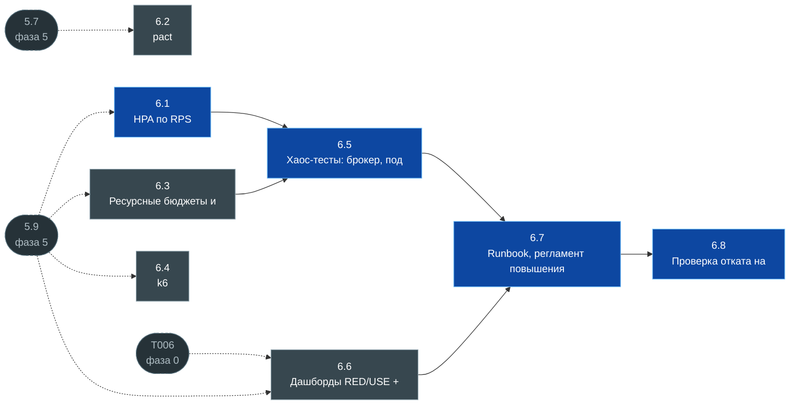

# 9. Граф задач

> **Файл генерируется.** Не редактируйте его руками — правьте
> [док. 8](08-tasks.md) и выполните `uv run python tools/task-graph.py`.
> Единственный источник статусов — таблицы задач в док. 8.

Готово **10 из 120** — задачи фаз 0-1 и рабочие пакеты фаз 2-6.

## Как читать

| Цвет | Значение |
|---|---|
| зелёный | готово |
| оранжевый | в работе |
| синий | не начата, **лежит на критическом пути** |
| серый | не начата, путь не блокирует |
| скруглённый, пунктирная рамка | задача из **другой фазы**, от которой зависит эта |

Стрелка `A --> B` читается «B зависит от A».
Пунктирная стрелка ведёт из другой фазы: она показывает, чем эта фаза
заблокирована снаружи. Такие узлы дублируются в своей фазе — статус у них
там, здесь они только для контекста.

## Критический путь

Самая длинная цепочка зависимостей — её нельзя сократить
распараллеливанием, только выполнением:

```
  T001 → T002 → T003 → T010 → T011 → T012
  T015 → T030 → T031 → T034 → T100 → T101
  T102 → T110 → T124 → T130 → T140 → T142
  T143 → 2.1 → 2.4 → 2.7 → 3.1 → 3.2
  5.4 → 5.9 → 6.1 → 6.5 → 6.7 → 6.8
```

Длина цепочки: **30**.

---

## Фаза 0 · Фундамент

Готово 10 из 47.



---

## Фаза 1 · catalog-service на FastAPI

Готово 0 из 31.



---

## Фаза 2 · Шина и разрыв связей

Готово 0 из 9.



---

## Фаза 3 · ClickHouse

Готово 0 из 8.



---

## Фаза 4 · Асинхронный сбор

Готово 0 из 8.



---

## Фаза 5 · Остальные сервисы и вывод Django

Готово 0 из 9.



---

## Фаза 6 · Продакшн-готовность

Готово 0 из 8.



